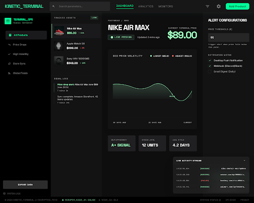

# PriceWatch -- CLI Price Monitoring Tool

A command-line price monitoring tool that scrapes product pages, tracks price history in SQLite, detects price drops, and displays results with Rich terminal formatting, sparkline micro-charts, and Unicode box-drawing tables.

```
  TRACKED PRODUCTS
  ID  Product                  Current    Previous   Change              Trend                 Status
  1   Wireless Headphones XM5  $279.99    $319.99    -40.00 (-12.5%)    ▃▅▇▅▃▂▁▃▅▇▆▅▄▃▂▁▂▃▅█   ●
  2   4K Monitor 27-inch       $389.99    $429.99    -40.00 (-9.3%)     ▇▇▅▆▄▃▅▇▆▅▃▂▃▅▆▇▅▃▂█   ●
  3   Mechanical Keyboard      $129.99    $139.99    -10.00 (-7.1%)     ▇▆▅▅▄▃▂▃▄▅▆▇▅▃▂▁▂▃▅█   ●
```

## Screenshot



## Features

- **Web Scraping** -- Fetch product pages with httpx + BeautifulSoup4 and extract prices via CSS selectors
- **Price History** -- SQLite database stores every price check with timestamps
- **Price Drop Alerts** -- Automatic detection of price decreases with savings and percentage
- **Sparkline Charts** -- Inline trend visualization in product tables
- **Unicode Box-Drawing Charts** -- Full price history rendered in the terminal
- **Rich Output** -- Kinetic Terminal design: neon green drops, red increases, blue sparklines
- **Retry Logic** -- Exponential backoff with jitter on failed HTTP requests
- **User-Agent Rotation** -- Randomized browser headers to reduce blocking
- **Export** -- Dump price history to CSV or JSON
- **Demo Mode** -- Local HTML product pages for offline testing

## Tech Stack

| Component | Library |
|-----------|---------|
| CLI | [Typer](https://typer.tiangolo.com/) |
| HTTP | [httpx](https://www.python-httpx.org/) |
| Parsing | [BeautifulSoup4](https://beautiful-soup-4.readthedocs.io/) + lxml |
| Database | SQLite3 (stdlib) |
| Terminal | [Rich](https://rich.readthedocs.io/) |
| Charts | Custom Unicode renderer (built with Rich) |

## Installation

```bash
git clone https://github.com/yourusername/pricewatch.git
cd pricewatch

python -m venv .venv
source .venv/bin/activate  # Linux/Mac
# .venv\Scripts\activate   # Windows

pip install -r requirements.txt
```

Verify the install:

```bash
python -m pricewatch --help
```

## Quick Start (Demo Mode)

No internet required -- seeds 3 products with local HTML files and price history:

```bash
python -m pricewatch demo
```

Then explore:

```bash
python -m pricewatch list            # table with sparklines
python -m pricewatch check           # scrape current prices
python -m pricewatch history 1       # Unicode price chart
python -m pricewatch alerts          # price drop alerts
python -m pricewatch export -f csv   # export to CSV
```

## Usage

### Add a product

```bash
pricewatch add "https://example.com/product" ".price-tag" --name "Gaming Mouse"
```

- `url` -- Product page URL
- `css_selector` -- CSS selector targeting the price element (`.price`, `#cost`, `span.amount`)
- `--name` / `-n` -- Friendly name (default: "Unnamed Product")

### List tracked products

```bash
pricewatch list
```

Shows a table with product ID, name, current/previous prices, change percentage, sparkline trend, and check status.

### Check prices

```bash
pricewatch check
```

Scrapes all tracked products, updates the database, and prints inline price changes with color-coded diffs.

### View price history

```bash
pricewatch history 1
pricewatch history 2 --limit 100
```

Renders a Unicode box-drawing chart of historical prices with current/lowest/highest/average stats.

### Price drop alerts

```bash
pricewatch alerts
```

Lists all products where the current price is lower than the previous price, showing savings amounts and drop percentages.

### Export data

```bash
pricewatch export --format csv
pricewatch export --format json --output my_data.json
```

### Remove a product

```bash
pricewatch remove 3
```

Deletes the product and its entire price history (cascade).

## Project Structure

```
pricewatch/
    __init__.py      # Package version
    __main__.py      # Entry point: python -m pricewatch
    cli.py           # Typer CLI commands with Kinetic Terminal styling
    database.py      # SQLite models, CRUD, price tracking
    scraper.py       # HTTP fetching, retry logic, price parsing
    display.py       # Rich tables, sparklines, Unicode charts, alerts
    export.py        # CSV and JSON export
    demo.py          # Demo mode: local HTTP server + sample data seeding
demo/
    headphones.html  # Sample product page (class selector)
    monitor.html     # Sample product page (id selector)
    keyboard.html    # Sample product page (tag.class selector)
tests/
    test_cli.py      # CLI command integration tests (18 tests)
    test_database.py # Database CRUD and price tracking (16 tests)
    test_display.py  # Formatting, sparklines, charts (18 tests)
    test_export.py   # CSV and JSON output (8 tests)
    test_demo.py     # Demo seeding and HTML validation (7 tests)
    test_scraper.py  # Price parsing, extraction, fetch (20 tests)
```

## Error Handling

| Function | Contract |
|----------|----------|
| `fetch_page` | Raises `ConnectionError` after 3 retries; `ValueError` on empty URL; `FileNotFoundError` on missing local file |
| `extract_price` | Returns `None` on empty HTML, empty selector, missing element, or unparseable text |
| `parse_price` | Returns `None` on empty/whitespace/non-numeric input; never raises |
| `scrape_price` | Returns `None` on any failure; never raises |

## Running Tests

```bash
pip install pytest
pytest tests/ -v
```

101 tests across 6 modules. All tests use temporary SQLite databases and require no network access.

## Design Tokens (Kinetic Terminal)

| Token | Value | Usage |
|-------|-------|-------|
| Surface | `#0e0e0f` | Dark background |
| Primary | `#a1ffc2` | Price drops, success, headlines |
| Secondary | `#ff7168` | Price increases, errors |
| Tertiary | `#69daff` | Sparklines, info, chart borders |
| Primary dim | dim green | Status dots |

## License

MIT
